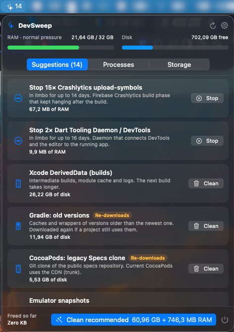
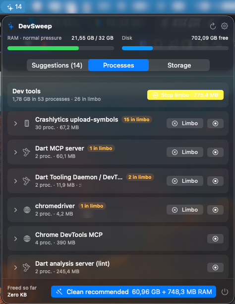
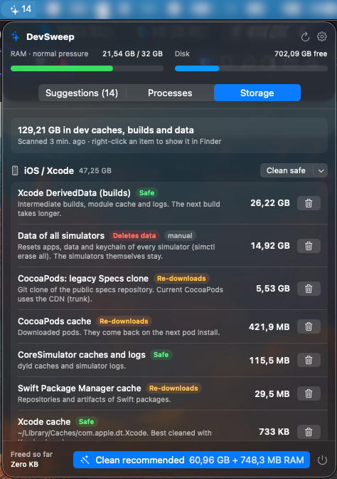
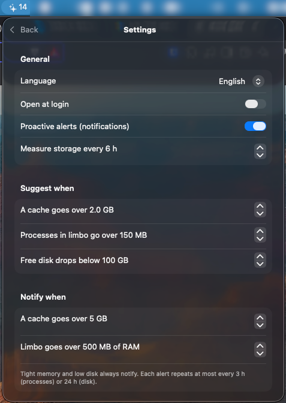

# DevSweep

[](https://github.com/Lukitaduarte/DevSweep/actions/workflows/ci.yml)
[](https://github.com/Lukitaduarte/DevSweep/actions/workflows/codeql.yml)
[](https://codecov.io/gh/Lukitaduarte/DevSweep)
[](https://scorecard.dev/viewer/?uri=github.com/Lukitaduarte/DevSweep)
[](https://coderabbit.ai)
[](https://github.com/Lukitaduarte/DevSweep/releases/latest)
[](#install)
[](https://www.bestpractices.dev/projects/14624)
[](LICENSE)

A macOS menu bar app for developers that tells you **what** to clean and **when**, then cleans it in one click: dev processes stuck in limbo, and the caches, builds and simulator data that Flutter, iOS, Android, Node/Next.js and Go leave behind.

Available in English, Português (Brasil) and Español.

<p align="center">
  
  
  
  
</p>

## What it does

- **Processes.** It finds dev tools left running after whatever started them has closed: orphaned language servers, Dart tooling daemons, hung Crashlytics `upload-symbols`, `go run` binaries, idle Gradle daemons, helpers of apps that already quit. Processes still in use by your editor are listed but never suggested.
- **Storage.** It measures DerivedData, Xcode indexes, Gradle caches of old versions, pub/npm/Go caches, FVM versions no project uses, `node_modules` and builds of projects you haven't touched in weeks, old `.ipa`/`.apk` files, and more.
- **Proactive.** It checks processes every 2 minutes and disk every few hours, and sends a notification with a **Clean now** button when something crosses your thresholds, memory gets tight or the disk runs low.
- **Safe by default.** Every item is labeled *Safe*, *Re-downloads* or *Deletes data*. Items that delete data are never cleaned in bulk and ask for confirmation.
- **Keeps itself up to date.** When a new version is out, you get an update card with a link to the changelog and a one-click install.

## Install

```bash
npx @lukitaduarte/devsweep                                          # one command, no Homebrew
```

or with Homebrew:

```bash
brew trust --tap lukitaduarte/devsweep
brew tap lukitaduarte/devsweep https://github.com/Lukitaduarte/DevSweep
brew install --cask devsweep
```

Homebrew 7 refuses to load casks from a tap you haven't trusted, which is why the first command exists — it's Homebrew asking you to confirm you meant to install software from outside its official taps, and it's a good habit to check what a tap contains before trusting it. Here that's a [single file](Casks/devsweep.rb).

Both paths download the release from GitHub, check it against the published SHA-256 and put **DevSweep.app** in `/Applications`.

Prefer to do it by hand? Download `DevSweep-x.y.z.zip` from the [latest release](https://github.com/Lukitaduarte/DevSweep/releases/latest), unzip it and move the app to `/Applications`. In that case macOS blocks the first launch, because releases aren't notarized by Apple yet: right-click the app → **Open** → **Open** (on macOS 15+, **System Settings → Privacy & Security → Open Anyway**). You only do this once, and updates install normally. The two commands above avoid that prompt, since files downloaded by a script aren't quarantined.

### Verifying a download

Every release asset is signed with [Sigstore](https://sigstore.dev) by the release workflow, carries SLSA build provenance and ships with an SBOM. The quickest check needs only the GitHub CLI:

```bash
gh attestation verify DevSweep-x.y.z.zip --repo Lukitaduarte/DevSweep
```

Or, with [cosign](https://docs.sigstore.dev/cosign/), against the signature bundle published next to the file:

```bash
cosign verify-blob DevSweep-x.y.z.zip \
  --bundle DevSweep-x.y.z.zip.sigstore.json \
  --certificate-identity-regexp '^https://github\.com/Lukitaduarte/DevSweep/\.github/workflows/release\.yml@refs/(heads/main|tags/v.+)$' \
  --certificate-oidc-issuer https://token.actions.githubusercontent.com
```

The identity covers both refs the workflow runs from: `refs/heads/main` for a normal release and `refs/tags/vX.Y.Z` when the assets of a tag are rebuilt. Either check proves the file came out of this repository's release workflow, not from someone re-uploading a zip.

### Build from source

Requires macOS 14+ and Xcode 16+ (or a Swift 6 toolchain).

```bash
git clone https://github.com/Lukitaduarte/DevSweep.git
cd DevSweep
make install     # builds, copies to /Applications and launches
```

Builds from source don't update themselves (they aren't signed with the release key). **Settings → Updates** links to the releases page instead.

To see what DevSweep would suggest on your Mac without changing anything:

```bash
DEVSWEEP_LIVE=1 swift test --filter LiveReportTests
```

## Updates

DevSweep checks this repository's releases once a day using [Sparkle](https://sparkle-project.org). Every update is signed with an EdDSA key and verified before it's installed. In **Settings → Updates** you can check now, turn on automatic installs, or open the releases and changelog.

## Customizing

Stack knowledge lives in YAML files under [`stacks/`](stacks), one per stack. You can add your own without rebuilding:

```bash
mkdir -p ~/.config/devsweep/stacks
cp docs/stack-template.yaml ~/.config/devsweep/stacks/my-stack.yaml
```

Then click **Settings → Stacks → Reload**. Entries with the same `id` as a bundled one replace it, and `disabled: true` turns one off.

## Trust and security

DevSweep deletes files and stops processes, so it's built to be easy to audit:

- **Open and small.** What gets detected and cleaned is plain YAML in [`stacks/`](stacks). Nothing is hidden in code.
- **Guard rails in code.**
  - It only deletes inside your home folder and refuses well-known roots (`~/Documents`, `~/Library/Caches`, …).
  - It only stops processes owned by your user, and first checks that the PID still runs the same command.
  - It never runs as root.
- **No telemetry.** The only network access is the daily update check against GitHub releases.
- **Checked on every change:**
  - [CodeQL](https://github.com/Lukitaduarte/DevSweep/security/code-scanning) static analysis;
  - [TruffleHog](https://github.com/trufflesecurity/trufflehog) secret scanning;
  - the [OpenSSF Scorecard](https://scorecard.dev/viewer/?uri=github.com/Lukitaduarte/DevSweep);
  - Dependabot updates;
  - AI code review by [CodeRabbit](https://coderabbit.ai);
  - tests that validate every rule and fail if personal data lands in the repository.
- **Signed updates** via Sparkle.

Found a problem? See [SECURITY.md](SECURITY.md).

## Contributing

New stacks, better rules and translations are very welcome, and most need no Swift. See [CONTRIBUTING.md](CONTRIBUTING.md). If you use [Claude Code](https://claude.com/claude-code), [`CLAUDE.md`](CLAUDE.md) and the skills in [`.claude/skills`](.claude/skills) walk it through adding stacks, translations, investigating detections and preparing screenshots.

## Maintaining

Cutting a release is merging the pull request release-please keeps open; everything else is automated. [`docs/MAINTAINING.md`](docs/MAINTAINING.md) covers the one-time setup — signing key, repository settings, Codecov, CodeRabbit, the Homebrew tap and npm — and [`.claude/skills/release/SKILL.md`](.claude/skills/release/SKILL.md) covers the release flow itself and what to do when part of it fails.

## Project layout

```
stacks/        what to detect and clean, per stack (YAML)
locales/       UI translations (YAML)
docs/          stack template, README images
Sources/DevSweep/
  App/           entry point, state, scheduling, updater
  Advisor/       what to suggest, notifications
  Core/          shell, formatting, localization, preferences
  Definitions/   YAML schema, loader, validation, path resolution
  Processes/     ps/lsof parsing, limbo detection, stopping processes
  Storage/       project scanning, providers, sizing, safe deletion
  UI/            menu bar popover
Tests/           unit tests plus validation of stacks, locales and privacy
scripts/         app bundle, release packaging, signing keys, screenshot redaction
```

## License

[MIT](LICENSE)
